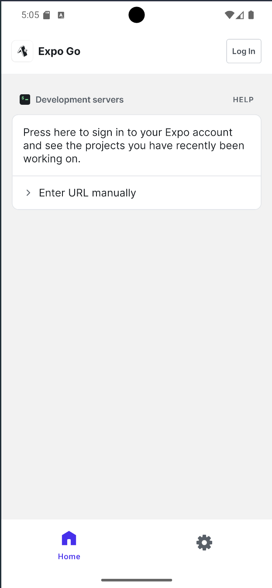

# Revision of the use of Expo in React-Native Development
This project was implemented based on the expo [tutorial](https://docs.expo.dev/tutorial/introduction/) provided in the [expo](https://expo.dev) site for understanding
the use of expo with [React-Native](https://reactnative.dev/) development.


## How to run this project (Non Dev)
* Download the expo go app [here](https://expo.dev/go)
* Copy the link below in the enter url section of the page shown in the image below <br>
> 

<br>

* Then click the connect button you see from the dropdown.

## How to run this project (as a dev with android emulator)
Run the following commands below

### Clone The Repo
```shell 
git clone https://github.com/obamwonyi/Expo-Revision
```

### Run the code
* cd into the project main directory
* Then run the command below

```shell 
npx expo start --clear
```

* Click a ( to open on android emulator ), i ( to open on iOS), or w ( to open on web ).
<br>
Please Note: the project is built to run on the three platforms specified above so things will work fine.

